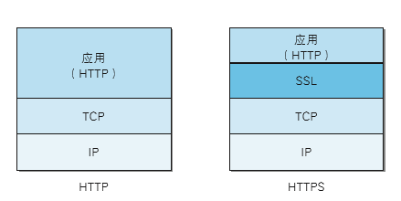
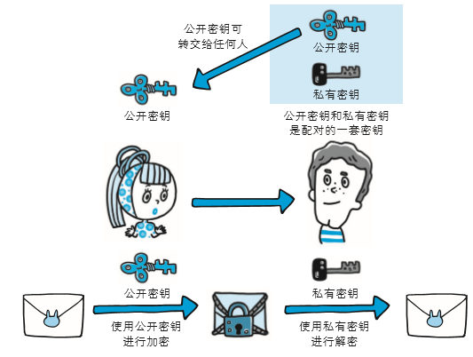
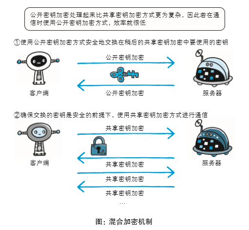

- [http的缺点](#http%e7%9a%84%e7%bc%ba%e7%82%b9)
  - [原因-通信使用明文可能会被窃听](#%e5%8e%9f%e5%9b%a0-%e9%80%9a%e4%bf%a1%e4%bd%bf%e7%94%a8%e6%98%8e%e6%96%87%e5%8f%af%e8%83%bd%e4%bc%9a%e8%a2%ab%e7%aa%83%e5%90%ac)
  - [解决方式-数据对象进行加密处理(防止被窃听)](#%e8%a7%a3%e5%86%b3%e6%96%b9%e5%bc%8f-%e6%95%b0%e6%8d%ae%e5%af%b9%e8%b1%a1%e8%bf%9b%e8%a1%8c%e5%8a%a0%e5%af%86%e5%a4%84%e7%90%86%e9%98%b2%e6%ad%a2%e8%a2%ab%e7%aa%83%e5%90%ac)
    - [通信的加密(https)](#%e9%80%9a%e4%bf%a1%e7%9a%84%e5%8a%a0%e5%af%86https)
    - [内容的加密](#%e5%86%85%e5%ae%b9%e7%9a%84%e5%8a%a0%e5%af%86)
  - [使用http会出现-不验证通信方的身份就可能遭遇伪装](#%e4%bd%bf%e7%94%a8http%e4%bc%9a%e5%87%ba%e7%8e%b0-%e4%b8%8d%e9%aa%8c%e8%af%81%e9%80%9a%e4%bf%a1%e6%96%b9%e7%9a%84%e8%ba%ab%e4%bb%bd%e5%b0%b1%e5%8f%af%e8%83%bd%e9%81%ad%e9%81%87%e4%bc%aa%e8%a3%85)
    - [任何人都可发起请求](#%e4%bb%bb%e4%bd%95%e4%ba%ba%e9%83%bd%e5%8f%af%e5%8f%91%e8%b5%b7%e8%af%b7%e6%b1%82)
    - [查明对手的证书](#%e6%9f%a5%e6%98%8e%e5%af%b9%e6%89%8b%e7%9a%84%e8%af%81%e4%b9%a6)
- [HTTPS = (HTTP+ 加密 + 认证 + 完整性保护)](#https--http-%e5%8a%a0%e5%af%86--%e8%ae%a4%e8%af%81--%e5%ae%8c%e6%95%b4%e6%80%a7%e4%bf%9d%e6%8a%a4)
  - [HTTP加上加密处理和认证以及完整性保护后即是HTTPS](#http%e5%8a%a0%e4%b8%8a%e5%8a%a0%e5%af%86%e5%a4%84%e7%90%86%e5%92%8c%e8%ae%a4%e8%af%81%e4%bb%a5%e5%8f%8a%e5%ae%8c%e6%95%b4%e6%80%a7%e4%bf%9d%e6%8a%a4%e5%90%8e%e5%8d%b3%e6%98%afhttps)
  - [HTTPS 是身披 SSL 外壳的 HTTP](#https-%e6%98%af%e8%ba%ab%e6%8a%ab-ssl-%e5%a4%96%e5%a3%b3%e7%9a%84-http)
  - [相互交换密钥的公开密钥加密技术](#%e7%9b%b8%e4%ba%92%e4%ba%a4%e6%8d%a2%e5%af%86%e9%92%a5%e7%9a%84%e5%85%ac%e5%bc%80%e5%af%86%e9%92%a5%e5%8a%a0%e5%af%86%e6%8a%80%e6%9c%af)
    - [共享密钥加密的问题(对称加密)](#%e5%85%b1%e4%ba%ab%e5%af%86%e9%92%a5%e5%8a%a0%e5%af%86%e7%9a%84%e9%97%ae%e9%a2%98%e5%af%b9%e7%a7%b0%e5%8a%a0%e5%af%86)
    - [使用两把密钥的公开密钥加密(非对称加密)](#%e4%bd%bf%e7%94%a8%e4%b8%a4%e6%8a%8a%e5%af%86%e9%92%a5%e7%9a%84%e5%85%ac%e5%bc%80%e5%af%86%e9%92%a5%e5%8a%a0%e5%af%86%e9%9d%9e%e5%af%b9%e7%a7%b0%e5%8a%a0%e5%af%86)
    - [HTTPS一般使用的加密与HASH算法](#https%e4%b8%80%e8%88%ac%e4%bd%bf%e7%94%a8%e7%9a%84%e5%8a%a0%e5%af%86%e4%b8%8ehash%e7%ae%97%e6%b3%95)
    - [HTTPS采用混合加密机制](#https%e9%87%87%e7%94%a8%e6%b7%b7%e5%90%88%e5%8a%a0%e5%af%86%e6%9c%ba%e5%88%b6)
    - [公开密钥的问题-CA证书](#%e5%85%ac%e5%bc%80%e5%af%86%e9%92%a5%e7%9a%84%e9%97%ae%e9%a2%98-ca%e8%af%81%e4%b9%a6)
    - [SSL响应速度](#ssl%e5%93%8d%e5%ba%94%e9%80%9f%e5%ba%a6)
- [HTTPS 的安全通信机制](#https-%e7%9a%84%e5%ae%89%e5%85%a8%e9%80%9a%e4%bf%a1%e6%9c%ba%e5%88%b6)
  
## http的缺点
- 通信使用明文（不加密），内容可能会被窃听
- 不验证通信方的身份，因此有可能遭遇伪装
- 无法证明报文的完整性，所以有可能已遭篡改

### 原因-通信使用明文可能会被窃听 
由于 HTTP 本身不具备加密的功能，所以也无法做到对通信整体（使用HTTP协议通信的请求和响应的内容）进行加密。即，HTTP报文使用明文（指未经过加密的报文）方式发送。

### 解决方式-数据对象进行加密处理(防止被窃听)

#### 通信的加密(https)
一种方式就是将通信加密。HTTP 协议中没有加密机制，但可以通过和 **SSL**（Secure Socket Layer，安全套接层）或 **TLS**（Transport Layer Security，安全传输层协议）的组合使用，加密 HTTP 的通信内容。   
> 用SSL建立安全通信线路之后，就可以在这条线路上进行 HTTP 通信了。与 SSL 组合使用的 HTTP 被称为 HTTPS（HTTP Secure，超文本传输安全协议）或 HTTP over SSL。

#### 内容的加密 
由于 HTTP 协议中没有加密机制，那么就对 HTTP 协议传输的内容本身加密。即把HTTP报文里所含的内容进行加密处理。在这种情况下，*客户端需要对HTTP报文进行加密处理后再发送请求* 。   
> 前提是要求客户端和服务器同时 具备加密和解密机制。主要应用在 Web 服务中。有一点必须引起注意， 由于该方式不同于 SSL 或 TLS 将整个通信线路加密处理，所以内容仍 有被篡改的风险。稍后我们会加以说明。

### 使用http会出现-不验证通信方的身份就可能遭遇伪装 
#### 任何人都可发起请求
在 HTTP 协议通信时，由于不存在确认通信方的处理步骤，任何人都可以发起请求。另外，服务器只要接收到请求，不管对方是谁都会返回一个响应（但也**仅限于**发送端的 IP 地址和端口号没有被 Web 服务器 设定限制访问的前提下）。 
- 无法确定请求发送至目标的Web服务器是否是按真实意图返回响应的那台服务器。有可能是已伪装的Web服务器。
- 无法确定响应返回到的客户端是否是按真实意图接收响应的那个客户端。有可能是已伪装的客户端。 
- 无法确定正在通信的对方是否具备访问权限。因为某些 Web 服 务器上保存着重要的信息，只想发给特定用户通信的权限。
- 无法判定请求是来自何方、出自谁手。 
- 即使是无意义的请求也会照单全收。无法阻止海量请求下的 DoS 攻击（Denial of Service，拒绝服务攻击）。

#### 查明对手的证书
虽然有使用 HTTP 协议确定报文完整性的方法，但事实上并不便捷、可靠。其中常用的是MD5 和 SHA-1 等散列值校验的方法，以及用 来确认文件的数字签名方法。 
提供文件下载服务的 Web 网站也会提供相应的以 PGP（Pretty Good Privacy，完美隐私）创建的数字签名及 MD5 算法生成的散列值。
> - PGP 是用来证明创建文件的数字签名 
> -MD5 是由单向函数生成的散列值。
   
不论使用哪一种方法，都需要客户端的用户**本人亲自检查**验证下载的文件是否就是原来服务器上的文件。浏览器无法自动帮用户检查。可惜的是，用这些方法也依然无法百分百保证确认结果正确。因为 PGP 和 MD5 本身被改写的话，用户是没有办法意识到的。为了有效防止这些弊端，有必要使用 HTTPS。SSL 提供认证和加 密处理及摘要功能。仅靠 HTTP 确保完整性是非常困难的，因此通过和 其他协议组合使用来实现这个目标。

## HTTPS = (HTTP+ 加密 + 认证 + 完整性保护) 

  

### HTTP加上加密处理和认证以及完整性保护后即是HTTPS 
如果在HTTP协议通信过程中使用未经加密的明文，比如在Web页面 中输入信用卡号，如果这条通信线路遭到窃听，那么信用卡号就暴露了。  
另外，对于 HTTP 来说，服务器也好，客户端也好，都是没有办法 确认通信方的。因为很有可能并不是和原本预想的通信方在实际通信。 并且还需要考虑到接收到的报文在通信途中已经遭到篡改这一可能性。 为了统一解决上述这些问题，需要在HTTP上再加入加密处理和认证等 机制。我们把添加了加密及认证机制的HTTP称为HTTPS（HTTP Secure）。
 
### HTTPS 是身披 SSL 外壳的 HTTP
HTTPS 并非是应用层的一种新协议。只是 HTTP 通信接口部分用 SSL（Secure Socket Layer）和 TLS（Transport Layer Security）协议代替 而已。   
通常，HTTP 直接和 TCP 通信。当使用 SSL 时，则演变成*先和 SSL 通信*，*再由 SSL 和 TCP 通信*。简言之，所谓 HTTPS，其实就是 身披 SSL 协议这层外壳的 HTTP。  
在采用 SSL 后，HTTP 就拥有了 HTTPS 的加密、证书和完整性保 护这些功能。 SSL 是独立于 HTTP 的协议，所以不光是 HTTP 协议，其他运行在 应用层的 SMTP 和 Telnet 等协议均可配合 SSL 协议使用。可以说 SSL 是当今世界上应用最为广泛的网络安全技术。 

### 相互交换密钥的公开密钥加密技术 
在对 SSL 进行讲解之前，我们先来了解一下加密方法。SSL 采用一 种叫做公开密钥加密（Public-key cryptography）的加密处理方式。   
近代的加密方法中**加密算法公开**的，而**密钥是保密的**。通过这种方式得以保持加密方法的安全性。   
加密和解密都会用到密钥。没有密钥就无法对密码解密，反过来说，任何人只要持有密钥就能解密了。如果密钥被攻击者获得，那加密也就失去了意义。  

#### 共享密钥加密的问题(对称加密) 
加密和解密同用一个密钥的方式称为共享密钥加密（Common key crypto system），也被叫做**对称密钥加密**。
以共享密钥方式加密时必须将密钥也发给对方。可究竟怎样才能安全地转交？在互联网上转发密钥时，如果通信被监听那么密钥就可会落入攻击者之手，同时也就失去了加密的意义。另外还得设法安全地保管接收到的密钥。

#### 使用两把密钥的公开密钥加密(非对称加密)
公开密钥加密使用一对非对称的密钥。一把叫做私有密钥（private key），另一把叫做公开密钥（public key）。顾名思义，私有密钥不能让 其他任何人知道，而公开密钥则可以随意发布，任何人都可以获得。使用公开密钥加密方式，发送密文的一方使用对方的公开密钥进行加密处理，对方收到被加密的信息后，再使用自己的私有密钥进行解密。利用这种方式，不需要发送用来解密的私有密钥，也不必担心密钥被攻击者窃听而盗走。  
> 要想根据密文和公开密钥，恢复到信息原文是异常困难的， 因为解密过程就是在对离散对数进行求值，这并非轻而易举就能办到。 退一步讲，如果能对一个非常大的整数做到快速地因式分解，那么密码 破解还是存在希望的。但就目前的技术来看是不太现实的。公开密钥加密方式很好地解决了共享密钥加密的困难。 
  
  

#### HTTPS一般使用的加密与HASH算法
- 非对称加密算法：RSA，DSA/DSS  
- 对称加密算法：AES，RC4，3DES  
- HASH算法：MD5，SHA1，SHA256  

#### HTTPS采用混合加密机制 
HTTPS 采用共享密钥加密和公开密钥加密两者并用的**混合加密机制**。若密钥能够实现安全交换，那么有可能会考虑仅使用公开密钥加密 来通信。但是公开密钥加密与共享密钥加密相比，其处理速度要慢。   
所以应充分利用两者各自的优势，将多种方法组合起来用于通信。在交换密钥环节使用公开密钥加密方式，之后的建立通信交换报文阶段则使用共享密钥加密方式。
  
  

#### 公开密钥的问题-CA证书
公开密钥加密方式无法证明公开密钥本身就是货真价实的公开密钥。比如，正准备和某台服务器建立公开密钥加密方式下的通信时，如何证明收到的公开密钥就是原本 预想的那台服务器发行的公开密钥。或许在公开密钥传输途中，真正的 公开密钥已经被攻击者替换掉了。 *可以使用由数字证书认证机构（CA，Certificate Authority）和其相关机关颁发的公开密钥证书。*  
1. 服务器的运营人员向数字证书认证机构提出公开密钥的申请。
2. 数字证书认证机构 在判明提出申请者的身份之后，会对已申请的公开密钥做数字签名，然后分配这个已签名的公开密钥，并将该*公开密钥放入公钥证书后绑定*在一起。 
3. 服务器会将这份由数字证书认证机构颁发的*公钥证书发送给客户端*，以进行公开密钥加密方式通信。
> 公钥证书也可叫做数字证书或直接称为证书。 
4. 接到证书的客户端可使用数字证书认证机构的公开密钥，对那张证书上的数字签名进行验证，一旦验证通过，客户端便可明确两件事：
   1. 认证服务器的公开密钥的是真实有效的数字证书认证机构。
   2. 服务器的公开密钥是值得信赖的。 
> 多数浏览器开发商发布版本时，会事先在内部植入常用认证机关的公开密钥。
     
  

#### SSL响应速度
当使用 SSL 时，它的处理速度会变慢。
- 指通信慢。
- 由于大量消耗 CPU 及内存等资源，导致处理速度变慢。 
和使用 HTTP 相比，网络负载可能会变慢 2 到 100 倍。除去和 TCP 连接、发送 HTTP 请求/响应以外，还必须进行 SSL 通信，因此整体上 处理通信量不可避免会增加。  
另一点是 SSL 必须进行加密处理。在服务器和客户端都需要进行 加密和解密的运算处理。因此从结果上讲，比起 HTTP 会更多地消耗服 务器和客户端的硬件资源，导致负载增强。  
> 针对速度变慢这一问题并没有根本性的解决方案，我们会使用 SSL 加速器这种（专用服务器）硬件来改善该问题。该硬件为 SSL 通信 专用硬件，相对软件来讲，能够提高数倍 SSL 的计算速度。仅在 SSL 处理时发挥 SSL 加速器的功效，以分担负载。

## HTTPS 的安全通信机制 

    

1. 客户端通过发送Client Hello报文开始SSL 通信。报文中 包含客户端支持的SSL的指定版本、加密组件（Cipher Suite）列表（所使用的加密算法及密钥长度等）。 
2. 服务器可进行SSL通信时，会以Server Hello报文作为应 答。和客户端一样，在报文中包含SSL 版本以及加密组 件。服务器的加密组件内容是从接收到的客户端加密组件 内筛选出来的。 
3. 之后服务器发送 Certificate 报文。报文中包含公开密钥 证书。 
4. 最后服务器发送Server Hello Done报文通知客户端，最初 阶段的SSL握手协商部分结束。 
5. SSL第一次握手结束之后，客户端以Client Key Exchange 报文作为回应。报文中包含通信加密中使用的一种被称为 Pre-master secret的随机密码串。该报文已用步骤3中的公 开密钥进行加密。 
6. 接着客户端继续发送Change Cipher Spec报文。该报文会 提示服务器，在此报文之后的通信会采用Pre-master secret 密钥加密。 
7. 客户端发送Finished报文。该报文包含连接至今全部报文 的整体校验值。这次握手协商是否能够成功，要以服务器 是否能够正确解密该报文作为判定标准。 
8. 服务器同样发送Change Cipher Spec报文。 
9. 服务器同样发送Finished报文。 
10. 服务器和客户端的Finished 报文交换完毕之后，SSL连接 就算建立完成。当然，通信会受到SSL的保护。从此处开 始进行应用层协议的通信，即发送HTTP请求。 
11. 应用层协议通信，即发送HTTP响应。 
12. 最后由客户端断开连接。断开连接时，发送 close_notify报文。*这步之后再发送TCP FIN报文来关闭与TCP 的通信*。   
>在以上流程中，应用层发送数据时会附加一种叫做 MAC（Message Authentication Code）的报文摘要。MAC 能够查知报文是否遭到篡改， 从而保护报文的完整性。   
  
了解：[HTTP和HTTPS握手的那些事](https://www.cnblogs.com/lovesong/p/5186200.html)   

从仅使用服务器端的公开密 钥证书（服务器证书）建立 HTTPS 通信的整个过程:  
  
